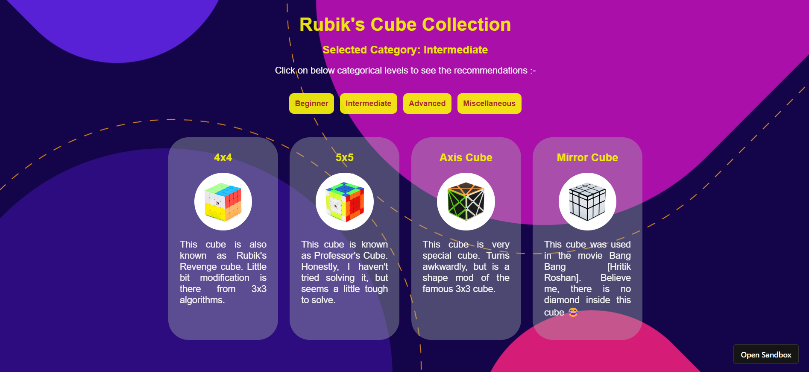

# Rubik's Cube Recommendations Webapp

Here, you will get a list of different Rubik's cube based of difficulty categories. Build in ReatJS, using Codesandbox.

Some of the webapp insights are as follows:

1. Cube recommendations for beginner level

2. Cube recommendations for intermediate level

> Check out other two category recommendations by [clicking here](https://0ucyk2.csb.app/) 

> Technologies/Libraries used :-
* ReactJS
* CSS
* HTML

> Platform used to develop project :-
* [Codesandbox](https://codesandbox.io/)
> Platform used to host and deploy the project :-
* [Github.com](https://github.com/ionbain)
* [Netlify.com](https://app.netlify.com/teams/bhaskartx/)
